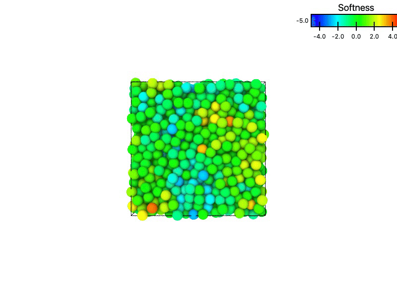
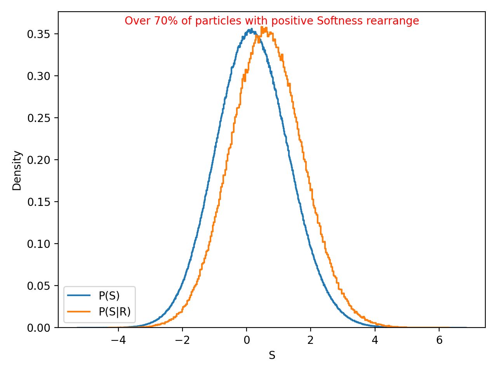

# SoftnessML API

A machine learning framework for predicting local rearrangement propensity ("softness") in supercooled liquids and glassy systems using structure-based descriptors and Support Vector Machine (SVM) models.

> **Machine learning framework for predicting particle rearrangements in supercooled liquids and glasses from local structure — served as a FastAPI microservice.**

[](https://www.python.org/downloads/)
[](https://fastapi.tiangolo.com/)
[](https://www.docker.com/)
[](LICENSE)

---

## Overview

SoftnessML API predicts the **"softness"** of particles in disordered systems — a machine-learning-derived scalar field that captures local structural environments and predicts which particles are likely to rearrange.

**Why this matters:** In supercooled liquids and glasses, dynamics are highly heterogeneous. Some particles rearrange frequently while others stay static. Softness bridges the gap between static structure and dynamics, enabling prediction of rearrangements from a single snapshot.

### What This Project Provides

- Calculation of **local structural descriptors** (radial, angular, and bond-orientational order parameters via spherical harmonics) from MD trajectories in GSD format
- Trained **Support Vector Machine (SVM)** model for softness prediction
- **FastAPI REST API** for integration into simulation pipelines
- **Numba-accelerated** computation for performance
- **Docker deployment** for reproducible environments

The implementation follows [Schoenholz et al. (2016)](https://www.nature.com/articles/nphys3644).

---

## 📈 Results

### Particle Trajectories Colored by Softness

Particles colored by their predicted softness field — warmer colors indicate higher softness (more likely to rearrange), cooler colors indicate lower softness (more stable).


*3D Lennard-Jones supercooled liquid at T=0.63. Color scale: blue (low softness, stable) → red (high softness, rearrangement-prone).*

### Softness Distribution: Rearranging vs. Non-Rearranging Particles

The distribution of softness for particles that rearrange — $P(S|R)$ — is shifted to higher values compared to particles that remain static demonstrating that softness is a strong predictor of rearrangement propensity.



The clear separation between the two distributions confirms that the SVM-learned softness field successfully captures structural features predictive of dynamics.

---

## Scientific Background

### What is Softness?

In supercooled liquids and glasses, particle dynamics are highly heterogeneous. **Softness** is a machine-learning-derived scalar field that captures the local structural environment of each particle and predicts its likelihood to undergo a rearrangement.

The concept was introduced by [Schoenholz et al. (2016)](https://www.nature.com/articles/nphys3644) and has become a widely used tool for linking structure to dynamics in amorphous materials.

### Applications

- **Fundamental Physics**: Glass transition and dynamic heterogeneity
- **Materials Science**: Stable amorphous materials, mechanical properties
- **Industrial**: Predicting aging, failure, and deformation in glassy systems

---

## Mathematical Framework

### Local Structure Descriptors

The local environment of each particle is characterized by three types of descriptors:

#### Radial Structure Functions

Capture local density variations at different distances:


$$
G_\mu(i) = \sum_{j \in \text{neighbors}} e^{-(r_{ij} - \mu)^2 / L^2}
$$


where $\mu$ are radial distance parameters and $L$ is a characteristic length scale.

#### Angular Structure Functions

Capture three-body correlations:


$$
\Psi_{\xi,\lambda,\zeta}(i) = \sum_{j,k \in \text{neighbors}} e^{-\xi^2(r_{ij}^2 + r_{ik}^2 + r_{jk}^2)} (1 + \lambda \cos\theta_{jik})^\zeta
$$


where $\theta_{jik}$ is the angle at particle $i$ formed by neighbors $j$ and $k$, and $\xi$, $\lambda$, $\zeta$ control radial decay and angular sensitivity.

#### Bond-Orientational Order Parameters (Steinhardt Parameters)

Quantify local rotational symmetry using spherical harmonics. For a central particle $i$, neighbors within annular shells (inner radii $r_\text{inner}$, width $\Delta r = 0.5$) are considered.

For each shell and each even angular momentum $l = 2, 4, 6, 8, 10, 12, 14$:


$$
q_{lm}(i) = \frac{1}{N_b(i)} \sum_{j \in \text{shell}} Y_{lm}(\theta_{ij}, \phi_{ij})
$$


$$
q_l(i) = \sqrt{\frac{4\pi}{2l+1} \sum_{m=-l}^{l} |q_{lm}(i)|^2}
$$


where $N_b(i)$ is the number of neighbors in the shell, $Y_{lm}(\theta, \phi)$ are spherical harmonics, and $(\theta_{ij}, \phi_{ij})$ are the polar and azimuthal angles of the vector from particle $i$ to neighbor $j$.

### Softness Prediction (SVM)

Softness is computed as a linear combination of structural descriptors using a trained SVM:


$$
S_i = \mathbf{w} \cdot \mathbf{x}_i + b
$$


where $\mathbf{x}$ is the concatenated feature vector, $\mathbf{w}$ is the learned weight vector, and $b$ is the bias term.

### Rearrangement Detection

The SVM is trained to separate particles that undergo significant motion using the **hop parameter** $p_\text{hop}$ [Candelier et al.](https://doi.org/10.1103/PhysRevLett.105.135702):


$$
p_\text{hop}(i,t) = \sqrt{\langle(\vec{r}_i(t) - \langle\vec{r}_i\rangle_{w_2})^2\rangle_{w_1} \langle(\vec{r}_i(t) - \langle\vec{r}_i\rangle_{w_1})^2\rangle_{w_2}}
$$


where time windows are $w_1 = [t-5, t]$ and $w_2 = [t, t+5]$ (in Lennard-Jones time units).

---

## Quick Start

### Prerequisites

- Python 3.9+
- Docker (recommended for deployment)

### Option 1: Docker (Recommended)

```bash
# Clone
git clone https://github.com/tomidiy/SoftnessML_api.git
cd SoftnessML_api

# Build and run
docker build -t softness-predictor .
docker run -d -p 8000:8000 \
    -v $(pwd)/data:/app/data \
    --name softness-predictor-container \
    softness-predictor

# Health check
curl http://localhost:8000/health
# → {"status": "healthy"}

# Predict softness
curl -X POST "http://localhost:8000/predict" \
    -H "Content-Type: application/json" \
    -d '{"temp": 0.7, "frame": 0, "gsd_file": "T0.7_idx0.gsd"}'
```

### Option 2: Local Development

```bash
git clone https://github.com/tomidiy/SoftnessML_api.git
cd SoftnessML_api
pip install -r app/requirements.txt

# Start the API server
uvicorn app.main:app --host 0.0.0.0 --port 8000

# Test
curl http://localhost:8000/health
```

### Required Data Files

Place the following in `data/`:

```
data/
├── Softness_train_data.pkl
├── Softness_train_data_radialSphericalHarmonics.pkl
├── phop_T<temp>.pkl
└── T<temp>_idx0.gsd
```

---

## API Reference

|
 Endpoint 
|
 Method 
|
 Description 
|
|
---
|
---
|
---
|
|
`/health`
|
`GET`
|
 Returns service health status 
|
|
`/predict`
|
`POST`
|
 Compute descriptors and predict softness 
|

### `POST /predict`

Computes structural descriptors (radial, angular, and spherical-harmonics-based bond-orientational parameters) from the specified GSD file and frame, then predicts softness using the trained SVM.

**Request:**

```json
{
    "temp": 0.7,
    "frame": 0,
    "gsd_file": "T0.7_idx0.gsd"
}
```

|
 Field 
|
 Type 
|
 Description 
|
|
---
|
---
|
---
|
|
`temp`
|
`float`
|
 Simulation temperature 
|
|
`frame`
|
`int`
|
 Trajectory frame index 
|
|
`gsd_file`
|
`string`
|
 GSD file name in 
`data/`
|

**Response:**

```json
{
    "softness": [0.42, -1.13, 0.87, ...],
    "num_particles": 1000
}
```

---

## Project Structure

```
SoftnessML_api/
├── app/
│   ├── main.py               # FastAPI application and endpoints
│   ├── model.py               # SVM model loading and prediction
│   ├── Structure.py           # Structural descriptor computation
│   └── requirements.txt       # Python dependencies
├── data/
│   ├── Softness_train_data.pkl
│   ├── Softness_train_data_radialSphericalHarmonics.pkl
│   ├── phop_T<temp>.pkl
│   └── T<temp>_idx0.gsd
├── Dockerfile
├── README.md
└── .github/workflows/ci.yml   # CI pipeline
```

---

## Tech Stack

|
 Component 
|
 Technology 
|
 Purpose 
|
|
---
|
---
|
---
|
|
 API Framework 
|
 FastAPI 
|
 REST endpoint serving 
|
|
 ML Model 
|
 scikit-learn (SVM) 
|
 Softness prediction 
|
|
 Descriptors 
|
 NumPy + SciPy + Numba 
|
 Structure function computation 
|
|
 Trajectory I/O 
|
 GSD 
|
 Read MD simulation files 
|
|
 Deployment 
|
 Docker 
|
 Reproducible containerized service 
|
|
 CI 
|
 GitHub Actions 
|
 Automated testing 
|

---

## Related Projects

- [Multi-Modal RAG over Scientific Papers](https://github.com/tomidiy/multimodal-rag-papers) — 
  RAG system for querying scientific papers using text, figures, and tables.

---

## References

1. Schoenholz, S. S., et al. (2016). *A structural approach to relaxation in glassy liquids.* Nature Physics, **12**, 469–471.
2. Cubuk, E. D., et al. (2015). *Identifying structural flow defects in disordered solids using machine-learning methods.* Physical Review Letters, **114**, 108001.
3. Steinhardt, P. J., Nelson, D. R., & Ronchetti, M. (1983). *Bond-orientational order in liquids and glasses.* Physical Review B, **28**, 784.

---

## License

MIT License — see [LICENSE](LICENSE).